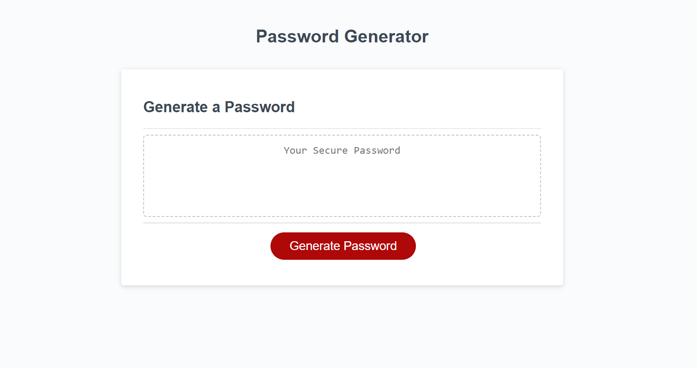
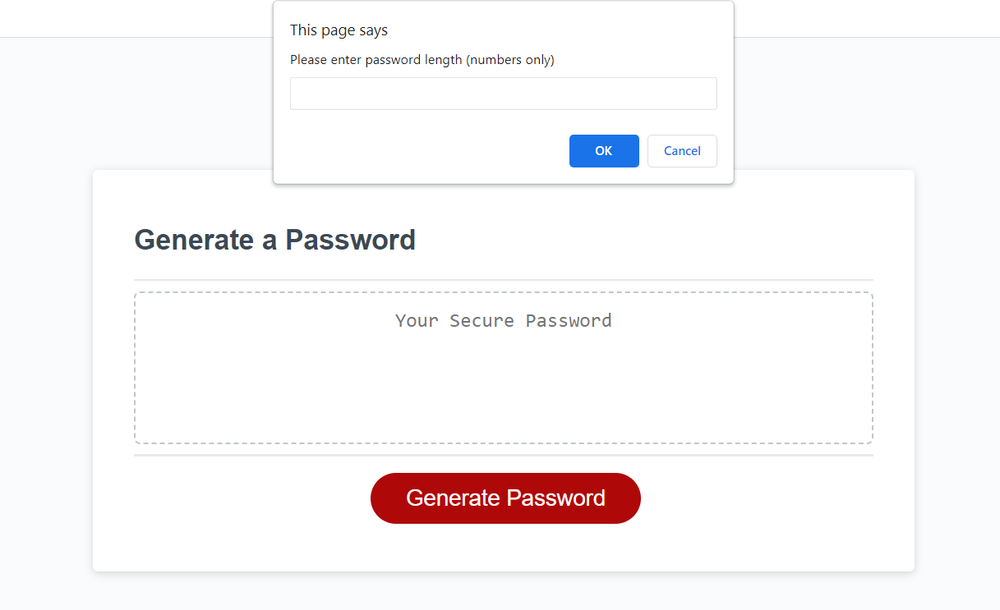
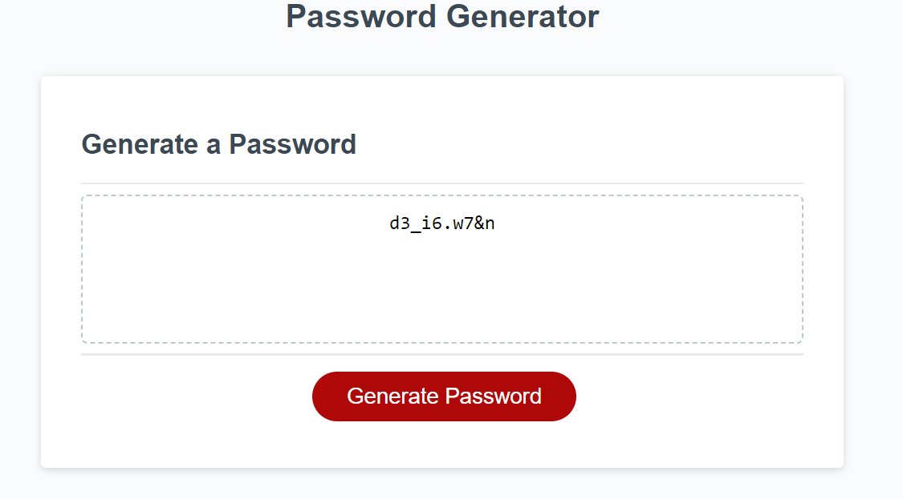

# password-generator

## Description

In this project, I coded a function to generate a random password based on character parameters. The function includes if statements, a while loop, arrays, and an event listener.

## Installation

N/A

## Usage

To use, open the webpage in the browser, then press the generate password button to generate a password. Select a password length of 8-128 characters. 4 confirm screens will display to choose character sets to include. After, a password will populate into the text box.

## Credits
N/A

## License

PLease refer to the license in the repo